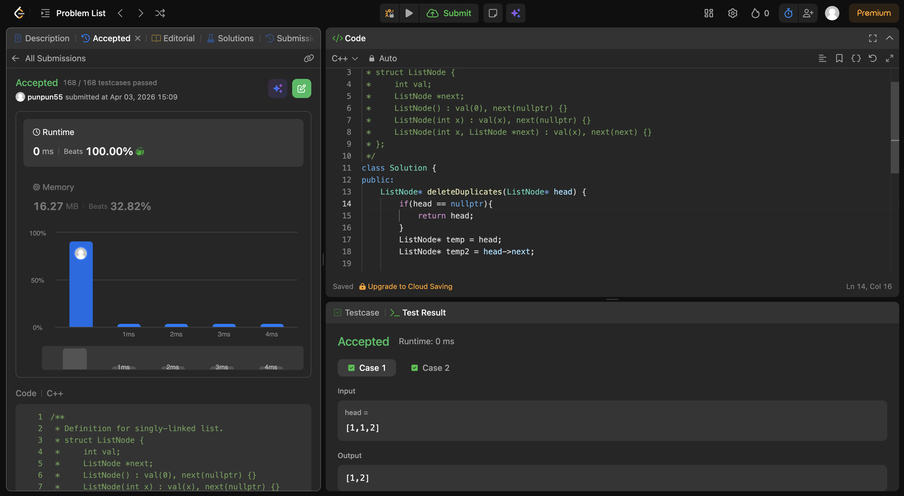

Just made 2 pointers , and if the ahead one has same value as the main one , then we move the ahead one to next and make the main one's next to be ahead one , so basically ignoring the middle repeated value one .. else we just move both to next pace and compare gaain through while loop. 