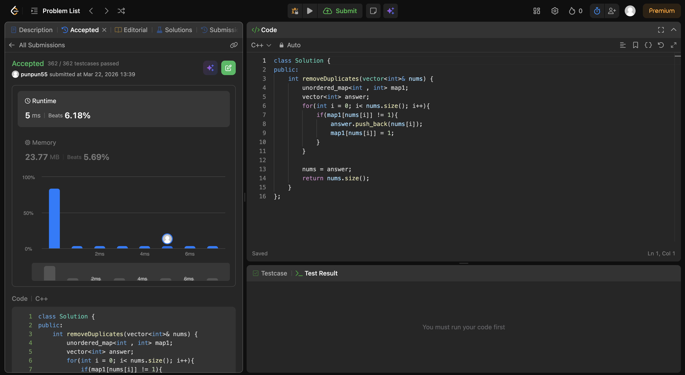

I just made new vector , and started storing elements from the original num vector into it.
FOr checking the uniqueness, I used the unordered_map, as the lookeup in those are O(1).

So hence, my solution is O(n), where n is the size of nums vector as I'm iterating in the nums vector in my for loop.

Hope this explanation suffices. 

Meet you on day-2.

