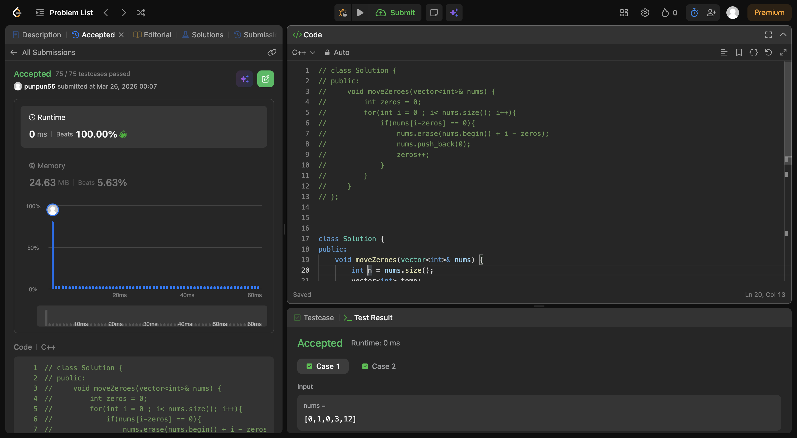
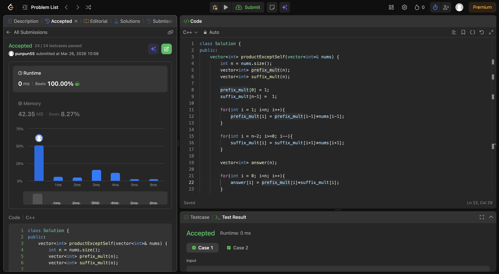

I first did erasing the zero and adding it back and indexing according to the numvber of zeros removed . but the runtime for that wasn't 0ms . Then later did the temp vector solution 

In this intermedate problem , I just stored the prefix_mults (not including the number) & similarly the suffix_mults and then for each index multiplied them. So done. For the follow up they needed 0 extra space, that I haven't done. Just the runtime is beating 100%.