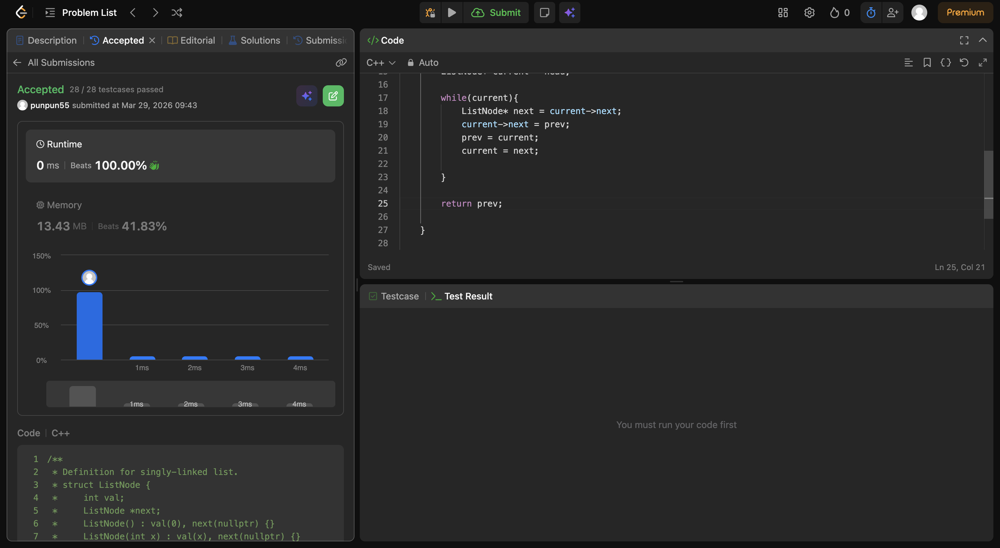
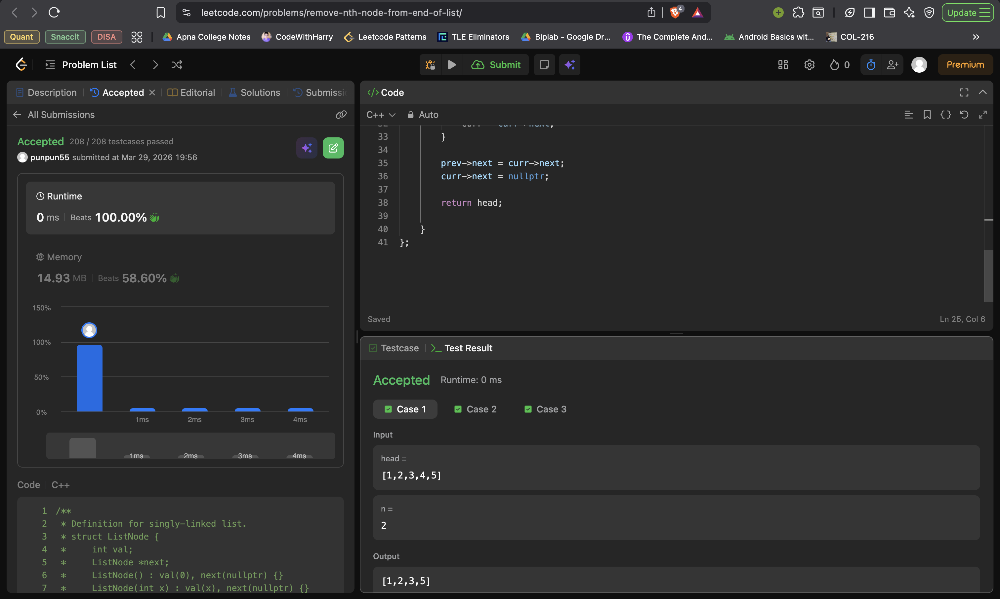

The standard method of having 3 pointers , a main one , then a previous to point the next , and a next to move to the next when the current->next has been moved to prev.

found the size, checked index from start went there , made the prev next to the next of the one we wanna delte .. so basically out of existence . and done. 

