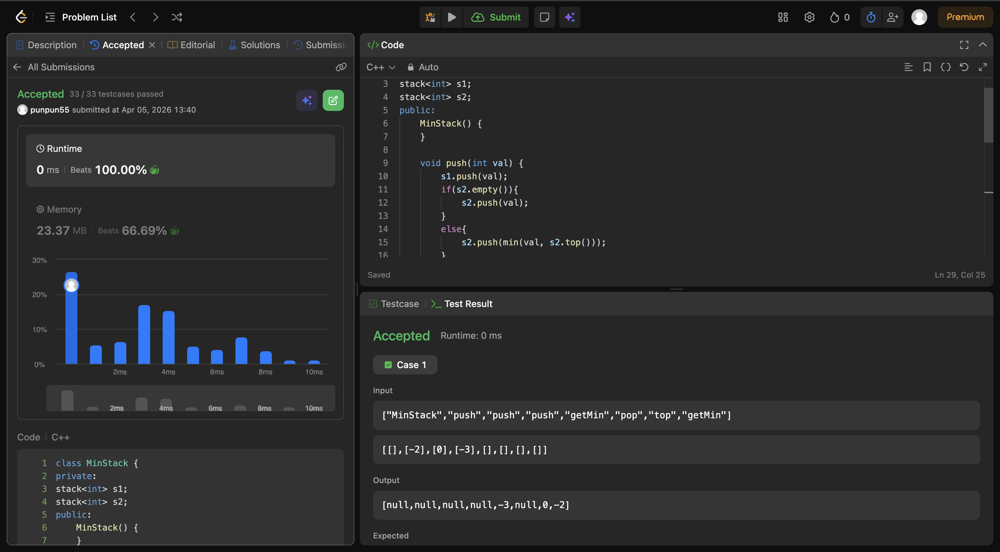

Used the normal stack method, pushing in the open brackets, comparing the top of stack if a closed bracket comes. 

Used two stacks, one main stack storing all values, the second storing the minimum at each step, basically minimum(s2.top(), new value);

so for minimum the top of second stack is there , while popping we pop from both.